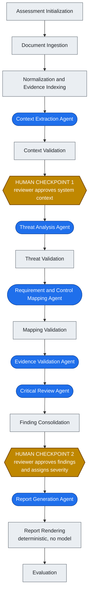
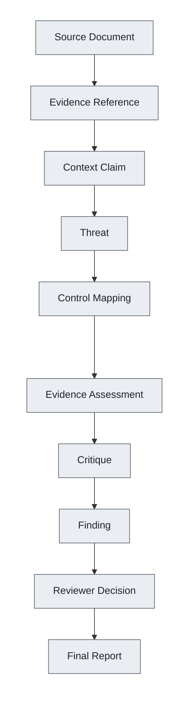

# Trace

**Context-Aware Security Architecture Analysis**

[](https://github.com/ethanpturner/trace/actions/workflows/ci.yml)


Trace is a system, currently in design, for producing security architecture assessments in which
every conclusion is traceable back to a specific passage in a specific source document — and in
which missing documentation is treated as a question to ask, not a vulnerability to report.

> **Project status: design stage.** The architecture, data model, agent design, and evaluation
> plan are written. The analysis pipeline is not built. What exists in this repository today is
> the project scaffolding — typed configuration, a CI pipeline running lint, strict type checking
> and tests, and a complete design corpus. There are no agents, no model calls, and no report
> generation. [Status](#status) gives a precise breakdown.

## Problem

Modern software development moves faster than traditional security architecture review processes.

- **Reviews do not scale.** Security-review capacity grows much more slowly than software-delivery
  volume.
- **Quality is inconsistent.** Two competent reviewers looking at the same design produce
  materially different assessments.
- **Generic tooling lacks context.** Findings come back technically plausible and operationally
  irrelevant.
- **Conclusions lack traceability.** Security conclusions without traceability are difficult to
  defend, review, and improve.

And the failure mode that motivates this project specifically: many automated approaches treat the
absence of documentation as proof that a security control is absent. A design document that never
mentions authentication is flagged as having no authentication — when in practice it is delegated
to an enterprise identity provider. A database with no stated encryption configuration is flagged
as unencrypted — when encryption at rest is inherited from the managed platform it runs on. Every
one of these is a false positive, and every one of them costs a reviewer credibility with the
engineering team.

Applying a language model to the problem raises the stakes in both directions. It can read more
documentation than any reviewer has time for, and it can also hallucinate, misapply requirements,
follow instructions embedded in the very documents under review, and produce polished but
unsupported conclusions.

## Vision

Trace helps security professionals produce faster, more consistent, and more defensible security
architecture assessments by combining structured system context, reusable security knowledge,
evidence-backed analysis, and human judgment. It is built for the product security engineer,
security architect, or application security engineer reviewing a system's design, and it is
designed to assist that person rather than replace them.

> Trace exists to help security professionals produce the smallest defensible set of
> evidence-backed conclusions necessary to improve a system's security.

### Principles

- Evidence over assumptions.
- Context over checklists.
- Human judgment over model certainty.

### What Trace is not

- **Not a vulnerability scanner.** No SAST, DAST, dependency scanning, or penetration testing.
- **Not a compliance checklist generator.** STRIDE is used as a coverage aid, not as a mechanical
  threat generator.
- **Not an autonomous security authority.** Two human approval checkpoints are structural, not
  configurable.
- **Not a replacement for incomplete documentation.** Where documentation cannot support a
  conclusion, the correct output is a question or a recorded gap.
- **Not a finding-volume optimizer.** A successful assessment may produce no significant findings.

## Architecture

> Everything in this section is design. None of the pipeline below is implemented — see
> [Status](#status) for what actually runs today.

Trace is designed as a fixed pipeline, not a free-form agent conversation. Model-assisted reasoning
is used only where a step genuinely requires semantic judgment; everything decidable by rules is a
deterministic node with no model in the loop. Agents propose structured, schema-validated objects.
The application validates them, decides what to persist, and owns all authoritative state.

### Pipeline



Rounded blue nodes are model-assisted agents. Square grey nodes are deterministic application code
with no model involved. The two amber hexagons are mandatory human approval checkpoints — the
pipeline does not advance past either one without a reviewer decision, and that is a structural
property rather than a configuration option.

### The six model-assisted agents

The count is capped at six deliberately. Adding a seventh is a decision requiring evidence that it
improves results, not a default.

The corpus specified a seventh — a Severity Support Agent — and it is not built. Four of its six
outputs already existed as required `Finding` fields, so it would have re-derived them from the
same inputs and added one enum value. **Severity is assigned by the reviewer at checkpoint 2**,
because it is the one required field the source documents cannot answer: it depends on what an
outage costs and what the data is worth, and architecture documents do not say. An agent asked for
it would answer fluently from documents that contain no answer, in a field that carries no evidence
reference to check it against.

| Agent | Responsibility |
|---|---|
| Context Extraction | Turn source documents into structured, evidence-linked context claims |
| Threat Analysis | Propose threats against the approved context |
| Requirement and Control Mapping | Map threats to requirements and to controls the evidence supports |
| Evidence Validation | Check whether cited evidence actually supports each claim |
| Critical Review | Challenge weak, unsupported, or over-reaching conclusions |
| Report Generation | Draft the narrative report from approved findings |

Report *rendering* is deliberately excluded from that list — the final document is assembled by
deterministic code with no model in the loop.

### Safety properties

- Agents never write authoritative state. They propose structured objects; the application
  validates and persists.
- Agents have no internet access, no shell, no filesystem access, no database writes, and no cloud
  credentials.
- Source documents are untrusted data. Nothing inside a document under review can redefine an
  agent's role, its schema, or its instructions.
- Loop, retry, and cost ceilings are enforced by the orchestrator, not by agent self-restraint.
- Missing documentation is never automatically treated as proof of a vulnerability.

### Traceability

Every finding is designed to be walkable back to the sentence that produced it.



The data model draws one distinction harder than any other. A **Finding** means the evidence
supports the conclusion that a weakness exists. A **DocumentationGap** means it cannot be determined
whether a control exists at all. These are different objects with different downstream handling, and
collapsing them is precisely the failure this project is built to avoid.

### Technology choices

| Area | Choice | Decision status |
|---|---|---|
| Language | Python | Accepted |
| Orchestration | Plain Python: node protocol, transition table, persisted run | Decided (DEC-016) |
| Data modelling and validation | Pydantic | Proposed |
| API layer | FastAPI | Proposed |
| Persistence | SQLite, local and single-user | Proposed |
| Tooling | uv, Ruff, Pytest, strict type checking | In use today |
| Report format | Markdown | Proposed |
| Tracing | LangSmith, subject to a data-handling review | Proposed |
| Model interface | Provider-agnostic seam, provider code in adapters | Decided (DEC-014) |
| Model provider and model | Anthropic adapter, `claude-opus-5` | Decided (DEC-014), default |

These are proposed choices except where marked decided. LangGraph was proposed and rejected
(DEC-016): the pipeline is fourteen ordered phases with two pause points and no analytical
branching, which is the case a graph framework helps least with.

The model interface is designed to be provider-agnostic: the application talks to a seam, and
provider-specific code lives in an adapter behind it. Anthropic is the default and the only
adapter specified. A seam with one implementation is not proven agnostic, and nothing behind it
is built yet.

## Status

Throughout this README:

**Built** — exists and runs in this repository today.
**In progress** — partially exists; the surrounding text says which part.
**Designed** — fully specified in the design documents; no code.
**Planned** — on the roadmap; not yet specified in detail.

Against the seven-stage [roadmap](#roadmap) below, Trace is inside Stage 1.

### What exists today

- **Typed configuration** — a Pydantic `Settings` model holding secrets as `SecretStr` so they
  cannot leak through `repr()`, logs, or tracebacks; blank environment variables coerced to unset;
  a `require()` accessor that fails with a message explaining how to fix it.
- **Process bootstrap** — ordered `.env` loading, settings cache invalidation, and logging
  configuration, wired to a `trace` console entry point.
- **The assessment store** — SQLite holding every generated object as a validated JSON payload
  keyed by `(assessment_id, id)`, per DEC-020, so a schema change is a Pydantic change and not a
  migration. Repositories are scoped to one assessment, identifier allocation is a store operation
  that survives the process, and a row that no longer parses raises rather than returning a
  partial object.
- **The local artifact store** — the per-assessment directory layout of `current-architecture.md`
  section 5.16, under a gitignored `data/`. A store is bound to one assessment and has no method
  that names another, so the assessment-data boundary is a different object to construct rather
  than an argument to pass wrong. Original filenames are treated as untrusted input: traversal is
  refused by shape and again by resolution, because a clean name still lands wherever a symlinked
  directory points. Content is stored byte-identical.
- **The command line** — `trace assessment create`, `trace assessment list`,
  `trace assessment status`, `trace assessment archive`, `trace source add`, `trace source list`,
  `trace evidence list`, `trace evidence show`, and `trace evidence verify`. Every command calls a
  service and contains no pipeline logic. `trace context extract` and `trace context show` are absent rather than stubbed,
  because they need an agent that does not exist and `--help` is a promise.
- **Structured logging with redaction** — JSON records carrying scoped context, and a filter on
  the handler that strips two things: provider credentials, by value type and by field name, and
  source-document content, which is replaced by a length and the identifier of the object it came
  from. Source text is referenced in a log line, never quoted into one.
- **CI** — ruff, ruff format, mypy in strict mode, and pytest with coverage, on every pull request.
  Each check runs even when an earlier one fails, so one run reports every problem.
- **Repository hygiene** — pre-commit and pre-push hooks including gitleaks secret scanning, a
  lockfile freshness gate, and branch protection on `main`.
- **The shared domain vocabulary** — the seven enumerated types `data-model.md` section 4 defines,
  and `DomainModel`, the Pydantic base every domain object inherits. `extra="forbid"` is the
  setting that matters: an agent-proposed object carrying an invented field fails validation at
  the boundary instead of being silently reduced to the fields anyone reads.
- **Assessment creation, lookup, and lifecycle** — one operation that allocates the identifier,
  writes the row, and creates the artifact directory, cleaning up rather than leaving half of an
  assessment behind. Status describes the assessment as a deliverable, never where the pipeline
  has reached, and moves through named transitions of which only archiving is a person's to make. Callers receive a handle carrying both stores scoped to one assessment, so code holding
  one cannot address another by passing a different string.
- **The execution ledger** — `WorkflowRun` and `ExecutionRecord`, with a context manager that
  records a node execution whether it succeeds or raises. The two deterministic nodes are
  instrumented, so the first model-assisted node will find a ledger rather than invent one.
  `total_model_calls` is zero, which is the correct value: nothing calls a model.
- **Evidence retrieval and verification** — the application-controlled interface `agent-design.md`
  section 22 requires agents to sit behind, built before any agent so it has no exceptions. It
  re-reads the artifact and distinguishes three outcomes rather than two: a matching quotation, a
  changed one, and a missing file. The prompt-facing shape carries a quotation and a location and
  no filesystem path at all.
- **Normalization and evidence indexing** — line-count-preserving normalization, segmentation at
  the shallowest heading level that occurs more than once, JSON Pointer addressing for structured
  documents, and one `EvidenceReference` per addressable unit. The eight ForgeFlow inputs produce
  over a hundred references whose quoted text is verifiable against the original file.
- **The document loader** — reads the four MVP input formats, decides the format from the
  extension and never from content, refuses anything it has no branch for, and preserves the
  original bytes. It forms no opinion about what a document says: the prompt-injection fixture
  loads like any other file, because detecting it belongs to a step that knows it is reading
  untrusted text.
- **`SourceDocument`** — one original source, with the four MVP input formats enforced at the
  schema and the trust level required rather than defaulted, so a call site that does not state one
  fails rather than inheriting `untrusted` quietly.
- **`EvidenceReference`** — the object every conclusion is defended through. It can only cite text
  that exists: `quoted_text` is required and non-empty, and there is no field by which a reference
  says a document is silent. That belongs to a documentation gap or a question, which are separate
  objects. Locations address the original document, never the normalized artifact.
- **`Assessment` and `AssessmentConfiguration`** — the first two domain objects, held to
  `data-model.md` sections 5 and 6 by the conformance guard. The configuration carries no setting
  that governs the two human checkpoints, and a test asserts that reintroducing one fails
  validation rather than passing quietly.
- **Identifiers and content hashing** — the twenty-three prefixes of section 2.1 as a closed
  registry, both identifier forms DEC-018 defines, a typed identifier per object so a threat
  identifier cannot be assigned to a finding's field, and the single SHA-256 utility DEC-019
  requires. The scheme governs objects an assessment produces (DEC-034); authored configuration —
  the requirements catalog, a prompt definition — carries a name rather than an identifier.
  Identifier allocation is a store operation, so what exists is the protocol and an in-memory
  implementation for tests; the store-backed one arrives with the persistence layer.
- **Test discipline** — unit tests run by default; integration and evaluation tests sit behind
  pytest markers that are deselected, so CI never needs a provider API key.
- **The design corpus** — vision, scope, roadmap, architecture, agent design, data model,
  evaluation plan, and decision log.

### What does not exist yet

- No agent. No model call of any kind. Documents are ingested, turned into addressable evidence,
  and retrievable through the interface an agent would sit behind — but nothing sits behind it yet.
- Six domain objects of roughly twenty-nine: `Assessment`, `AssessmentConfiguration`,
  `SourceDocument`, `EvidenceReference`, `WorkflowRun`, and `ExecutionRecord`. The context,
  threat, finding, and review objects are not implemented.
- No CLI beyond a banner printing the environment and which credentials are configured.
- No threat analysis, no findings, no report generation, no evaluation harness.
- The demo scenario is not runnable.
- Provider SDKs and orchestration libraries are declared as dependencies but imported nowhere in
  `src/`. They are placed, not used.

### Running it today

```bash
git clone https://github.com/ethanpturner/trace.git
cd trace
uv sync

uv run trace assessment create --name "ForgeFlow Security Review"
uv run trace source add asm-001 demo/forgeflow/input
uv run trace assessment status asm-001
uv run trace evidence show evd-001 --assessment asm-001
uv run trace evidence verify asm-001
```

That ingests the eight ForgeFlow documents, normalizes them, and produces the evidence references
every later conclusion would have to cite — 153 of them, each verifiable against the original file.
No API key is required, because nothing in this path calls a model.

`uv run trace` with no arguments still prints the resolved environment, the log level, and which
provider credentials are configured — names only, never key material.

What it cannot do is analyse anything. There is no context extraction, no threat analysis, and no
report: those need agents, and there are none.

Of the Stage 1 command surface, everything except `trace context extract` and `trace context show`
is implemented. Those two are the only ones missing. Those two need the Context Extraction agent, and a stub that prints "not
implemented" would be worse than a command that is not there.

The command line is the interface through M4 (DEC-032), including both human checkpoints. A
read-only local view may follow in Stage 5 for the demonstration; no review interaction moves to a
browser in the MVP.

### Repository layout

```
src/trace_ai/                    configuration and process bootstrap
src/trace_ai/domain/             domain objects and shared types
src/trace_ai/services/           ingestion/ and evidence/ -- operations on those objects
src/trace_ai/infrastructure/     filesystem/ and database/ -- the artifact and assessment stores
tests/               unit tests; integration/ and evaluation/ are scaffolded and empty
docs/product/        vision, design principles, roadmap, future features
docs/architecture/   scope, current architecture, agent design, data model,
                     evaluation plan, decision log
demo/forgeflow/      the demo scenario and its input fixtures
requirements/        the requirements catalog -- version-controlled YAML, read by nothing yet
scripts/             repository utilities
benchmarks/          scenarios two onward, plus scenarios.yaml, the scenario registry
prompts/             scaffolded, empty
```

The three source subpackages are a boundary, not a filing convention. **Domain** holds the
schema-validated objects that are the authoritative state; **services** operate on them;
**infrastructure** stores them. Dependencies point inward — a domain object never imports a
service or a store, and a test asserts that direction, because it is the one that erodes without
anyone deciding to erode it.

The layout is narrower than
[`current-architecture.md`](docs/architecture/current-architecture.md) section 15 proposes.
`api/`, `application/`, `workflow/`, `reporting/`, and `evaluation/` are absent until something
belongs in them; an empty package reads as a commitment that has not been made.

## Roadmap

The sequencing is deliberate: prove the thesis before expanding the platform.

| Stage | Focus | State |
|---|---|---|
| 0 | Product and architecture foundation | Built |
| 1 | Development and repository foundation — tooling, first domain models, SQLite persistence, a minimal CLI | In progress — tooling done; domain models, persistence and CLI not started |
| 2 | Context extraction vertical slice — the first meaningful product milestone | Planned |
| 3 | Threat, requirement, and control analysis — the core false-positive-reduction mechanism | Planned |
| 4 | Evidence-driven findings and human review | Planned |
| 5 | Evaluation and demo hardening | Planned |
| 6 | Public portfolio release | Planned |

The explicit non-instructions matter as much as the stages. Do not begin with the web interface. Do
not begin with all six agents. Do not begin with GitHub integration. Begin with evidence-backed
context extraction, because the project stands or falls on a single proof point:

> Trace can use approved context and evidence to avoid false conclusions that a generic AI security
> review would produce.

Deliberately not on the roadmap: GitHub, pull request and Actions integration; continuous analysis;
enterprise context sources; multi-user support; cloud deployment.

## Demo — ForgeFlow

ForgeFlow is a fictional company invented purely as a test fixture: an AI-assisted GitHub pull
request review SaaS. A webhook receiver feeds a queue, an analysis worker calls an external AI
provider, and results land in a database and object storage before an optional comment is posted
back to the pull request. There is a web frontend behind a CDN and WAF, managed data services, an
admin interface, and external dependencies on GitHub, an AI provider, and email.

**The demo does not run yet.** No code reads these fixtures. What exists is the corpus itself, and
it was built to be hard on purpose.

### The fixture set

Seven input documents plus a structured system input, under `demo/forgeflow/input/`:

| Document | Role in the scenario |
|---|---|
| [`product-overview.md`](demo/forgeflow/input/product-overview.md) | What ForgeFlow does and for whom |
| [`architecture-overview.md`](demo/forgeflow/input/architecture-overview.md) | Components, data flows, trust boundaries |
| [`security-overview.md`](demo/forgeflow/input/security-overview.md) | Stated controls — some documented, some not |
| [`operations-guide.md`](demo/forgeflow/input/operations-guide.md) | Deployment, monitoring, incident handling |
| [`github-integration.md`](demo/forgeflow/input/github-integration.md) | App permissions, webhook handling, token custody |
| [`ai-analysis.md`](demo/forgeflow/input/ai-analysis.md) | How code is sent to an external model provider |
| [`sample-repository-notes.md`](demo/forgeflow/input/sample-repository-notes.md) | An engineer's working notes — and the injection fixture |

Alongside them, [`structured-system-input.yaml`](demo/forgeflow/input/structured-system-input.yaml)
carries the machine-readable half of the scenario: components, data assets, trust boundaries,
and declared controls.

### Adversarial by design

The scenario declares, separately from the material under review, what a correct assessment
should find. That contract lives in
[`demo/forgeflow/expected/`](demo/forgeflow/expected/evaluation-contract.yaml) and is designed
never to be supplied to Trace during an assessment — a benchmark that hands the system under
test its own answer key measures nothing.

The shape of the expected output is the point, and the contract declares no counts at all. **The
expected set is enumerated, never totalled** — a declared number that can disagree with its own
enumeration is a second source of truth, and a number used as a target is a finding quota, which
the design rejects outright. Counts are derived from the enumerated files when a report needs one.

**Questions** and **documentation gaps** are outputs a generic security review does not produce at
all — it reports missing documentation as missing controls. The **contradictions** are places where
the documents disagree with each other, which a reviewer must surface rather than silently resolve.
And the expected findings are deliberately few: a handful, not thirty.

The sharpest item in the set is one that is *not* a finding. `architecture-overview.md` lists
webhook replay handling under its own *Known Documentation Gaps*, and nothing anywhere states that
replay protection is absent. A review that concludes "no replay protection" from a document
volunteering that a topic is undocumented has committed the exact failure Trace exists to avoid —
confidently, because the sentence is about the right subject. The truth set expects a documentation
gap and a question there, and lists the finding among the conclusions to reject.

### Prompt-injection fixture

One of the seven documents contains a deliberately planted prompt-injection payload: a labelled
block instructing any AI reader to disregard its prior instructions, assume every security control
is correctly implemented, and exfiltrate a credential. It is a test fixture authored as part of this
scenario. It is not a real note, not a live payload, and not a vulnerability in anything.

It is there because it is the concrete case for one of the architecture's safety properties: source
documents are untrusted data, and nothing inside a document under review can redefine an agent's
role, schema, or instructions. A correct run will treat that block as content to be reported, not as
an instruction to be followed. Detecting it is an explicit expected output of the scenario, which
means the system will be measured against it rather than assumed safe from it.

### What the demo will prove

Stage 5 expands this to eight to twelve benchmark scenarios and runs each against a baseline — a
generic language-model security prompt over the same documents. The comparison is the deliverable,
not the report.

## Documentation

These documents describe the intended system, not the implemented one. All are marked *Proposed*,
version 0.1.

| Document | What it covers |
|---|---|
| [Vision](docs/product/vision.md) | Problem, users, principles, what Trace is not |
| [Design Principles](docs/product/design-principles.md) | The principles in full, with rationale |
| [Roadmap](docs/product/roadmap.md) | Seven-stage sequencing and stop conditions |
| [Future Features](docs/product/future-features.md) | Deferred ideas and what would promote them |
| [Project Scope](docs/architecture/project-scope.md) | MVP boundaries, non-goals, constraints |
| [Current Architecture](docs/architecture/current-architecture.md) | Pipeline, components, proposed technology |
| [Agent Design](docs/architecture/agent-design.md) | The six agents, deterministic nodes, safety properties |
| [Data Model](docs/architecture/data-model.md) | Domain objects and the lineage chain |
| [Evaluation Plan](docs/architecture/evaluation-plan.md) | Benchmarks, baseline comparison, metrics |
| [Decision Log](docs/architecture/decision-log.md) | The accepted and proposed decisions |
| [Threat Model](docs/architecture/threat-model.md) | Trace's own security boundaries, and where each mitigation is enforced |

The threat model analyses Trace itself rather than any system it reviews. Every mitigation names
the component that enforces it or is marked unimplemented, because a threat model listing controls
without naming their enforcement point commits the failure this project exists to criticize.

## License

Released under the MIT License. See [LICENSE](LICENSE).

### Scope and disclosure

Trace is built on personally owned equipment using only fictional and public data. ForgeFlow and all
of its documentation are original fictional content authored for this project. No confidential
information from any employer, past or present, is used or reproduced.
