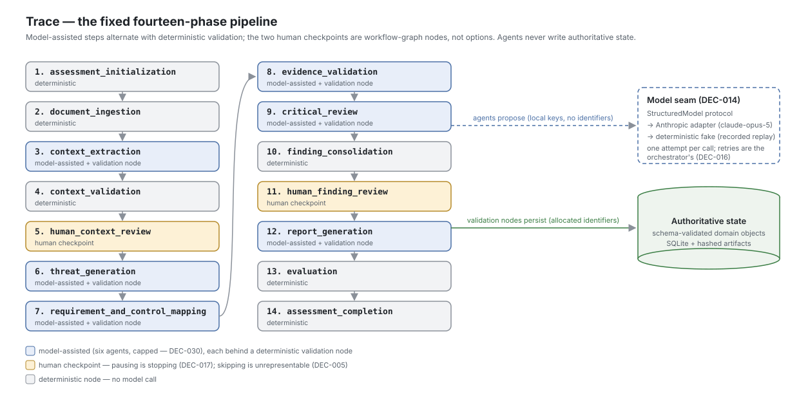
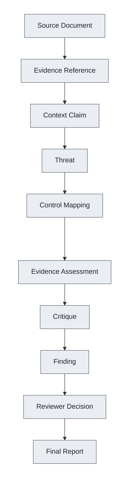

# Trace

**Context-Aware Security Architecture Analysis**

[](https://github.com/ethanpturner/trace/actions/workflows/ci.yml)


Trace is a system for producing security architecture assessments in which every conclusion is
traceable back to a specific passage in a specific source document — and in which missing
documentation is treated as a question to ask, not a vulnerability to report.

> **Project status: the pipeline runs end to end and measures itself offline.** All six agents
> are built, all fourteen phases run under the orchestrator, both structural human checkpoints
> hold, and the evaluation harness replays registered benchmark scenarios against authored truth
> sets — baselines, ablations, the adversarial condition, and a CI-checked scorecard included. A
> person can register documents, run the pipeline, review and approve the context, review the
> candidate findings and assign severities, and render the report — from the command line, with a
> provider or from recorded responses. The fastest verifiable claim in the repository is one
> command:
>
> ```bash
> uv run python scripts/replay_forgeflow.py
> ```
>
> It replays a committed ForgeFlow run through every phase with no API key and exits non-zero if
> the rendered report's content hash stops matching the pinned one. The demonstration surface
> exists too: the terminal recording below, the read-only `trace view`, and the committed demo
> script all replay the same fixtures. The flagship ForgeFlow recording was captured from a live
> `claude-opus-5` run on 2026-08-14 and replays offline byte-for-byte; the other scenario
> recordings remain authored offline, and each provenance says which. [Status](#status) gives a
> precise breakdown.


The recording is rendered from [`demo/forgeflow/pipeline-demo.tape`](demo/forgeflow/pipeline-demo.tape)
by [VHS](https://github.com/charmbracelet/vhs), and CI re-renders it when the tape or the command
surface changes — the demo is derived from the commands, not captured beside them.


## Related projects

Trace's founding distinction — DEC-009, that missing documentation is never proof of a
vulnerability — is applied to three other layers of the AI stack by sibling projects:

| | Domain | Status |
|---|---|---|
| [whence](https://github.com/ethanpturner/whence) | Model supply chain: is a declared lineage asserted or established? | Phase one runs |
| [tearline](https://github.com/ethanpturner/tearline) | Retrieval entitlements: does the index agree with the source system? | Runs against fixtures |
| [attestrun](https://github.com/ethanpturner/attestrun) | Evaluation attestation: is a published result re-derivable? | Minimal implementation |

All four use the same three-valued verdict — `verified`, `contradicted`, `unverifiable` — and none
of them uses a boolean or a confidence score.

## Problem

Modern software development moves faster than traditional security architecture review processes.

- **Reviews do not scale.** Security-review capacity grows much more slowly than software-delivery
  volume.
- **Quality is inconsistent.** Two competent reviewers looking at the same design produce
  materially different assessments.
- **Generic tooling lacks context.** Findings come back technically plausible and operationally
  irrelevant.
- **Conclusions lack traceability.** Security conclusions without traceability are difficult to
  defend, review, and improve.

And the failure mode that motivates this project specifically: many automated approaches treat the
absence of documentation as proof that a security control is absent. A design document that never
mentions authentication is flagged as having no authentication — when in practice it is delegated
to an enterprise identity provider. A database with no stated encryption configuration is flagged
as unencrypted — when encryption at rest is inherited from the managed platform it runs on. Every
one of these is a false positive, and every one of them costs a reviewer credibility with the
engineering team.

Applying a language model to the problem raises the stakes in both directions. It can read more
documentation than any reviewer has time for, and it can also hallucinate, misapply requirements,
follow instructions embedded in the very documents under review, and produce polished but
unsupported conclusions.

## Vision

Trace helps security professionals produce faster, more consistent, and more defensible security
architecture assessments by combining structured system context, reusable security knowledge,
evidence-backed analysis, and human judgment. It is built for the product security engineer,
security architect, or application security engineer reviewing a system's design, and it is
designed to assist that person rather than replace them.

> Trace exists to help security professionals produce the smallest defensible set of
> evidence-backed conclusions necessary to improve a system's security.

### Principles

- Evidence over assumptions.
- Context over checklists.
- Human judgment over model certainty.

### What Trace is not

- **Not a vulnerability scanner.** No SAST, DAST, dependency scanning, or penetration testing.
- **Not a compliance checklist generator.** STRIDE is used as a coverage aid, not as a mechanical
  threat generator.
- **Not an autonomous security authority.** Two human approval checkpoints are structural, not
  configurable.
- **Not a replacement for incomplete documentation.** Where documentation cannot support a
  conclusion, the correct output is a question or a recorded gap.
- **Not a finding-volume optimizer.** A successful assessment may produce no significant findings.

## Architecture

> Everything in this section runs today. It was designed before it was built, and the corpus
> under `docs/` remains the authoritative specification — see [Status](#status) for what is still
> open around the pipeline.

Trace is designed as a fixed pipeline, not a free-form agent conversation. Model-assisted reasoning
is used only where a step genuinely requires semantic judgment; everything decidable by rules is a
deterministic node with no model in the loop. Agents propose structured, schema-validated objects.
The application validates them, decides what to persist, and owns all authoritative state.



The image is the committed source (`docs/assets/architecture.svg`, hand-authored SVG); the phase
names in it are pinned to `workflow/phases.py` by `tests/unit/test_architecture_image.py`.

### Pipeline


Rounded blue nodes are model-assisted agents. Square grey nodes are deterministic application code
with no model involved. The two amber hexagons are mandatory human approval checkpoints — the
pipeline does not advance past either one without a reviewer decision, and that is a structural
property rather than a configuration option.

### The six model-assisted agents

The count is capped at six deliberately. Adding a seventh is a decision requiring evidence that it
improves results, not a default.

The corpus specified a seventh — a Severity Support Agent — and it is not built. Four of its six
outputs already existed as required `Finding` fields, so it would have re-derived them from the
same inputs and added one enum value. **Severity is assigned by the reviewer at checkpoint 2**,
because it is the one required field the source documents cannot answer: it depends on what an
outage costs and what the data is worth, and architecture documents do not say. An agent asked for
it would answer fluently from documents that contain no answer, in a field that carries no evidence
reference to check it against.

| Agent | Responsibility |
|---|---|
| Context Extraction | Turn source documents into structured, evidence-linked context claims |
| Threat Analysis | Propose threats against the approved context |
| Requirement and Control Mapping | Map threats to requirements and to controls the evidence supports |
| Evidence Validation | Check whether cited evidence actually supports each claim |
| Critical Review | Challenge weak, unsupported, or over-reaching conclusions |
| Report Generation | Draft the narrative report from approved findings |

Report *rendering* is deliberately excluded from that list — the final document is assembled by
deterministic code with no model in the loop.

### Safety properties

- Agents never write authoritative state. They propose structured objects; the application
  validates and persists.
- Agents have no internet access, no shell, no filesystem access, no database writes, and no cloud
  credentials.
- Source documents are untrusted data. Nothing inside a document under review can redefine an
  agent's role, its schema, or its instructions.
- Loop, retry, and cost ceilings are enforced by the orchestrator, not by agent self-restraint.
- Missing documentation is never automatically treated as proof of a vulnerability.

### Traceability

Every finding is designed to be walkable back to the sentence that produced it.



The data model draws one distinction harder than any other. A **Finding** means the evidence
supports the conclusion that a weakness exists. A **DocumentationGap** means it cannot be determined
whether a control exists at all. These are different objects with different downstream handling, and
collapsing them is precisely the failure this project is built to avoid.

### Technology choices

| Area | Choice | Decision status |
|---|---|---|
| Language | Python | Accepted |
| Orchestration | Plain Python: node protocol, transition table, persisted run | Decided (DEC-016) |
| Data modelling and validation | Pydantic | Proposed |
| API layer | FastAPI | Proposed |
| Persistence | SQLite, local and single-user | Proposed |
| Tooling | uv, Ruff, Pytest, strict type checking | In use today |
| Report format | Markdown | Proposed |
| Tracing | LangSmith, subject to a data-handling review | Proposed |
| Model interface | Provider-agnostic seam, provider code in adapters | Decided (DEC-014) |
| Model provider and model | Anthropic adapter, `claude-opus-5` | Decided (DEC-014), default |

These are proposed choices except where marked decided. LangGraph was proposed and rejected
(DEC-016): the pipeline is fourteen ordered phases with two pause points and no analytical
branching, which is the case a graph framework helps least with.

The model interface is designed to be provider-agnostic: the application talks to a seam, and
provider-specific code lives in an adapter behind it. Anthropic is the default; an OpenAI
adapter is the second implementation (DEC-095), both held to one behavioural contract by the
adapter conformance suite. No live OpenAI pipeline run has been measured.

## Status

Throughout this README:

**Built** — exists and runs in this repository today.
**In progress** — partially exists; the surrounding text says which part.
**Designed** — fully specified in the design documents; no code.
**Planned** — on the roadmap; not yet specified in detail.

Against the seven-stage [roadmap](#roadmap) below, Trace has completed Stage 4 and, of Stage 5's
decomposition into milestones M6 through M9, the assembly (M6), evaluation (M7), and adversarial
(M8) milestones: the pipeline the earlier stages specified runs end to end from the command line
and measures itself offline. The demo-hardening (M10), decision-debt (M12), and
surface-completion (M13) milestones are closed, and the evaluation milestone (M11) is closed but
for the recorded prompt- and model-comparison protocols. Of Stage 6's public portfolio half of
M9, the architecture image, the interview package, and the presentation folder have landed; what
remains open is the narrated demo video.

### What exists today

- **Typed configuration** — a Pydantic `Settings` model holding secrets as `SecretStr` so they
  cannot leak through `repr()`, logs, or tracebacks; blank environment variables coerced to unset;
  a `require()` accessor that fails with a message explaining how to fix it.
- **Process bootstrap** — ordered `.env` loading, settings cache invalidation, and logging
  configuration, wired to a `trace` console entry point.
- **The assessment store** — SQLite holding every generated object as a validated JSON payload
  keyed by `(assessment_id, id)`, per DEC-020, so a schema change is a Pydantic change and not a
  migration. Repositories are scoped to one assessment, identifier allocation is a store operation
  that survives the process, and a row that no longer parses raises rather than returning a
  partial object.
- **The local artifact store** — the per-assessment directory layout of `current-architecture.md`
  section 5.16, under a gitignored `data/`. A store is bound to one assessment and has no method
  that names another, so the assessment-data boundary is a different object to construct rather
  than an argument to pass wrong. Original filenames are treated as untrusted input: traversal is
  refused by shape and again by resolution, because a clean name still lands wherever a symlinked
  directory points. Content is stored byte-identical.
- **The command line** — `trace assessment create`, `trace assessment list`,
  `trace assessment status`, and `trace assessment archive`; `trace source add` and
  `trace source list`; `trace evidence list`, `trace evidence show`, and `trace evidence verify`;
  the context checkpoint as `trace context extract`, `trace context show`,
  `trace context review`, and `trace context approve`; the pipeline as `trace run` and
  `trace resume`; the finding checkpoint as `trace findings show`, `trace findings review`, and
  `trace findings approve`; `trace report show`; and `trace verify`. Every command calls a
  service and contains no pipeline logic, and the exit codes are documented answers: a pause and
  a completion are 0, a failed run is 1, a refused approval is 1 and names every blocker.
- **Structured logging with redaction** — JSON records carrying scoped context, and a filter on
  the handler that strips two things: provider credentials, by value type and by field name, and
  source-document content, which is replaced by a length and the identifier of the object it came
  from. Source text is referenced in a log line, never quoted into one.
- **CI** — ruff, ruff format, mypy in strict mode, and pytest with coverage, on every pull request.
  Each check runs even when an earlier one fails, so one run reports every problem.
- **Repository hygiene** — pre-commit and pre-push hooks, gitleaks secret scanning locally and
  over the full history in CI, a lockfile freshness gate, and branch protection on `main`.
- **The shared domain vocabulary** — the seven enumerated types `data-model.md` section 4 defines,
  and `DomainModel`, the Pydantic base every domain object inherits. `extra="forbid"` is the
  setting that matters: an agent-proposed object carrying an invented field fails validation at
  the boundary instead of being silently reduced to the fields anyone reads.
- **Assessment creation, lookup, and lifecycle** — one operation that allocates the identifier,
  writes the row, and creates the artifact directory, cleaning up rather than leaving half of an
  assessment behind. Status describes the assessment as a deliverable, never where the pipeline
  has reached, and moves through named transitions of which only archiving is a person's to make. Callers receive a handle carrying both stores scoped to one assessment, so code holding
  one cannot address another by passing a different string.
- **The execution ledger** — `WorkflowRun` and `ExecutionRecord`, with a context manager that
  records a node execution whether it succeeds or raises. The two deterministic nodes are
  instrumented, so the first model-assisted node will find a ledger rather than invent one.
  `total_model_calls` is zero, which is the correct value: nothing calls a model.
- **Evidence retrieval and verification** — the application-controlled interface `agent-design.md`
  section 22 requires agents to sit behind, built before any agent so it has no exceptions. It
  re-reads the artifact and distinguishes three outcomes rather than two: a matching quotation, a
  changed one, and a missing file. The prompt-facing shape carries a quotation and a location and
  no filesystem path at all.
- **Normalization and evidence indexing** — line-count-preserving normalization, segmentation at
  the shallowest heading level that occurs more than once, JSON Pointer addressing for structured
  documents, and one `EvidenceReference` per addressable unit. The eight ForgeFlow inputs produce
  over a hundred references whose quoted text is verifiable against the original file.
- **The document loader** — reads the five input formats (the MVP's four text formats, and PDF
  text-layer extraction per DEC-123, where an image-only PDF is refused rather than ingested
  empty), decides the format from the extension and never from content, refuses anything it has
  no branch for, and preserves the original bytes. It forms no opinion about what a document
  says: the prompt-injection fixture loads like any other file, because detecting it belongs to
  a step that knows it is reading untrusted text.
- **`SourceDocument`** — one original source, with the five input formats enforced at the
  schema and the trust level required rather than defaulted, so a call site that does not state one
  fails rather than inheriting `untrusted` quietly.
- **`EvidenceReference`** — the object every conclusion is defended through. It can only cite text
  that exists: `quoted_text` is required and non-empty, and there is no field by which a reference
  says a document is silent. That belongs to a documentation gap or a question, which are separate
  objects. Locations address the original document, never the normalized artifact.
- **`Assessment` and `AssessmentConfiguration`** — the first two domain objects, held to
  `data-model.md` sections 5 and 6 by the conformance guard. The configuration carries no setting
  that governs the two human checkpoints, and a test asserts that reintroducing one fails
  validation rather than passing quietly.
- **The five architecture objects** — `Component`, `Actor`, `Asset`, `DataFlow`, and
  `TrustBoundary`, the context baseline a reviewer approves at checkpoint 1. Type fields are open
  vocabularies normalized to one spelling (DEC-036), because the project's own benchmark uses six
  component types the data model never lists. Unknown transport encryption is the string `unknown`
  rather than `false` or absence, and an undocumented exposure is `None` rather than `False` — the
  DEC-009 discipline expressed at field level.
- **The Context Extraction node** — the first model-assisted step: assemble the fenced input,
  compose the prompt, ask the seam for a proposal, convert it into objects with
  application-allocated identifiers, and record what the call cost. It produces `SystemContext`
  version 1, unapproved, and stops. Every test runs against the deterministic substitute.
- **The Context Validation node** — `agent-design.md` section 8's ten responsibilities, each with
  its own test, and the constraint that shapes them: the node reports and routes, and never
  reinterprets or corrects. It also computes section 7's six human-review triggers.
- **The extractor's input package** — evidence reaching the agent through an application-controlled
  interface rather than a filesystem, every excerpt fenced and carrying its identifier, fence
  delimiters inside source text neutralised, and a budget overrun naming what it dropped. Assembly
  is deterministic, which is what makes the replay cache usable.
- **The context-extraction proposal schema** — one object the extractor is asked to return,
  structurally incapable of carrying an identifier, a status, an approval, a severity, or a
  finding. Proposed objects reference each other by local key; the application allocates the
  identifiers at conversion.
- **The workflow runtime** — the fourteen phases as an explicit transition table, the node
  protocol covering all three execution types, and the five ceilings `agent-design.md` section 27
  requires, checked before a step rather than after it. There is no orchestration framework
  (DEC-016). Every phase runs the nodes the table declares for it, in the table's order, and a
  declared node left unregistered stops the run rather than being skipped.
- **The checkpoint machinery** — both structural checkpoints share it: pause by persisting and
  exiting, resume by reading in a new process, and a review package derived from the run rather
  than stored in it. There is no way to express skipping a checkpoint, which is the property
  DEC-005 asks for.
- **The error taxonomy and retry policy** — a closed vocabulary that keeps an output which failed
  to parse apart from an analysis that cannot be concluded, bounded exponential backoff, validation
  feedback carried into the next attempt, and the failed output preserved in the assessment's debug
  area rather than in an error message.
- **The prompt registry and the first prompts** — `extract-context-v1` and the three shared blocks
  (source-content boundary, evidence policy, uncertainty policy), composed rather than copied, with
  the hash taken over the composed text. The proposal schema is *substituted* into the prompt from
  the application's own export, so the prompt cannot describe a shape the application would reject.
- **The model seam** — one protocol between the application and any provider (DEC-014), a
  deterministic substitute and a replay cache behind the same interface, and `model_profile`
  resolving to a provider, a model, generation settings, and published rates. Each adapter —
  Anthropic and OpenAI (DEC-095) — makes exactly one attempt and returns a structured failure
  carrying the raw output rather than raising; a test asserts each may import exactly its own
  provider SDK and nothing else in the tree imports one.
- **Identifiers and content hashing** — the twenty-six prefixes of section 2.1 as a closed
  registry, both identifier forms DEC-018 defines, a typed identifier per object so a threat
  identifier cannot be assigned to a finding's field, and the single SHA-256 utility DEC-019
  requires. The scheme governs objects an assessment produces (DEC-034); authored configuration —
  the requirements catalog, a prompt definition — carries a name rather than an identifier.
  Identifier allocation is a store operation: a monotonic per-`(assessment, prefix)` counter whose
  increment commits with the insert that consumes it, so a resumed run cannot re-mint an
  identifier that already exists.
- **Checkpoint 1** — the context approval gate, and it is a return value rather than a check.
  `ContextReviewNode` names the `SystemContext` among the objects awaiting a decision whenever it
  is not approved, and the orchestrator advances only on an empty list — so there is no path to
  threat analysis that does not pass an approved context, and no argument that could make one. The
  gate reads `approved_at` and `approved_by` rather than counting decisions, so a row written by
  something other than the approval path does not open it.
- **The review package** — every context object grouped by type, every claim with its status,
  confidence, and the passages it rests on, the human-review triggers that fired with the objects
  that caused them, and open questions with blocking ones first. Documented claims are kept apart
  from inferred, assumed, unknown, and contradicted ones, because one undifferentiated list is how
  an interpretation becomes a confirmed fact by layout. Excerpts are labelled
  `quoted untrusted source content` and are verbatim.
- **The reviewer's actions** — approve, reject, edit, add a missing object, correct a data flow,
  confirm an assumption, resolve a contradiction, answer a question, attach evidence, and request
  re-extraction. An edit mutates the object in place and records only the fields that changed,
  before and after (DEC-023), so the generated value stays recoverable after the object has moved
  on. A correction that would dangle a data-flow endpoint is refused in the validation node's own
  words. Approval mints the next `SystemContext` revision: version 1 is what the extractor
  produced and is never approved, version 2 is what a person approved.
- **The command line for the slice** — `trace context extract`, `show`, `review`, and `approve`,
  plus `trace assessment status` reporting the run's phase, its counters, and what checkpoint it is
  waiting at. `context review` takes flags or round-trips an editable YAML file; both write
  identical decision rows, because both call the same functions. A refused approval exits non-zero
  and names every blocker.
- **The ForgeFlow truth set** — `demo/forgeflow/expected/`, fully authored: the expected context,
  threats, control mappings, findings, documentation gaps, questions, observations, and
  rejections, derived from the eight input documents and nothing else. The scenario narrative
  knows more than the documents do, and grading against that would reward invention; so every
  entry cites the document and section it rests on, and a test resolves the citation. Nothing
  under `expected/` is ever supplied to Trace, and three tests enforce it.
- **The prompt-injection regression tests** — one per planted instruction, each crafting the
  response a compliant model would return and asserting the application refuses it. The defence
  does not rest on the model behaving.
- **The four reasoning agents and their validators** — Threat Analysis, Requirement and Control
  Mapping (one call per threat, the whole catalog every call per DEC-024), Evidence Validation,
  and Critical Review, each paired with a deterministic validator that reports and routes rather
  than corrects. Mapping validation applies DEC-025's and DEC-046's downgrades; a blocking
  validation error stops the run under its own error class, because the conclusion is never
  retried.
- **Findings and checkpoint 2** — DEC-013's thirty-cell outcome table routes every mapping;
  consolidation, duplicate detection with traceable merge records, and critique application
  preserve lineage rather than deleting it. Severity is the reviewer's to assign (DEC-030), and
  approval runs a deterministic gate whose override is recorded, never silent (DEC-055). The
  assessment's lifecycle moves with the run: `pending_review` commits with the pause,
  `draft` returns with the resume (DEC-031).
- **The report** — assembled from approved objects only, four prose sections from the Report
  Generation agent, twelve rendered deterministically from the template (DEC-035), the whole
  document checked by a consistency validator before a byte reaches `outputs/`, and a manifest
  pinning the content hash and every version the run depended on.
- **The pipeline driver** — `services/driver.py` composes a node for every name the transition
  table declares and the orchestrator walks all fourteen phases, pausing at the two checkpoints
  by persisting the state and exiting (DEC-017). Resuming is a read in a new process; a
  checkpoint with undecided subjects pauses again.
- **`trace verify`** — re-hashes every stored document, re-checks every evidence reference, and
  verifies the report manifest against the store. Drift is reported as identifier, expected hash,
  found hash — never content.
- **The recorded ForgeFlow replay** — `demo/forgeflow/recorded/` holds a complete run captured
  live from `claude-opus-5`: every model response the run consumed, in consumption order and
  including the four retried attempts, both checkpoints' reviewer decisions — four findings
  approved with severities, one rejected on DEC-009 grounds — provenance with version pins, and
  the pinned content hash of the report. `scripts/replay_forgeflow.py` replays it byte-for-byte
  with no provider, and the default test suite replays it on every run.
- **The evaluation harness** — `trace evaluate` replays any registered scenario offline from its
  committed recording, scores it against the authored truth set, runs the DEC-074 baselines
  through the same seam, applies the DEC-012 ablations with the run marked non-authoritative,
  and writes a results feed under `benchmarks/results/`. `scripts/build_scorecard.py` renders
  the committed per-scenario [scorecard](docs/eval/scorecard.html), `scripts/build_comparison.py`
  the per-tool [comparison table](docs/eval/comparison.md), and `scripts/build_ablation.py` the
  [ablation table](docs/eval/ablation.md); CI fails if any of the three drifts from the recorded
  runs. `build_scorecard.py --snapshot` retains a build in `docs/eval/history.jsonl`, keyed by
  git ref, prompt-tree digest, and catalog version, and the scorecard renders the retained
  history alongside the current table (DEC-081).
- **The adversarial condition** — DEC-075's poisoned-document variant with all five payload
  classes, run as an ordinary scenario condition, with the two-axis attack metrics (detection,
  and injected-instruction compliance with a target of zero) reported per payload class.
- **The fifteen benchmark scenarios** — every registered scenario carries a full outcome truth
  set and an offline recording, every roadmap Stage 5 coverage category has a scenario — the
  thirteenth (rag-support-bot, DEC-098) exercises the 0.2 catalog's AI-system requirements, the
  fourteenth (reply-tuner, DEC-114) exercises the 0.3 catalog's fine-tuning pack, and the
  fifteenth (nightly-reconciler, DEC-122) exercises the org-controls assertion, its two
  suppressions resting on asserted organizational facts — and `trace evaluate --all` runs the
  register with nothing skipped. The corpus is described as a versioned artifact in
  [the benchmark package](docs/eval/benchmark-package.md) (DEC-146): `benchmarks/manifest.yaml`
  names every scenario's files, pins, and digests, CI fails when it drifts from the corpus, and
  the specification's limitations section states what the numbers do not establish.
- **The M12 decision debt, closed** — DEC-057 through DEC-072 (risk treatment, episodic revisit,
  routing reasons, the STRIDE coverage baseline, the precedent feed, catalog-gap candidates,
  fingerprints, cache accounting, context extensions, profile overlays, parsers, the coverage
  ledger, the TM-BOM export, and catalog 0.2) are built, wired, and tested.
- **The read-only view and the demo** — `trace view` renders a completed assessment over
  localhost, GET-only, including the finding-lineage walk from a finding back to its hashed
  evidence (DEC-078). The [demo script](docs/product/demo-script.md) stages the offline run as ten
  timed beats with a recovery plan whose every fallback is a committed artifact.
- **The export family** — `trace export tm-bom`, `trace export sarif`, and `trace export mermaid`,
  the DEC-072 serializer family: deterministic serializers over approved objects only, with no
  prose and no model call. SARIF carries approved findings and reviewer-assigned severities only;
  the Mermaid DFD renders the approved context. DEC-108 adds an HTML rendering of the Markdown
  report as a derived view — a rendering, never a second format.
- **Assessment diffing** — `trace diff` compares two assessments of the same system by content
  fingerprint (DEC-097), pairing threats and documentation gaps across runs, and
  `trace diff --report` writes the comparison as a Markdown report into the later assessment's
  outputs (DEC-103), outside the DEC-035 report contract.
- **The organizational control catalog** — `org-controls/`, a version-controlled catalog of
  organization-wide controls read by its own loader (DEC-115). An organizational control enters
  context as an existence-only documented claim, never as authority, and the oidc-portal
  scenario asserts one from its first commit.
- **Test discipline** — unit tests run by default; integration and evaluation tests sit behind
  pytest markers that are deselected, so CI never needs a provider API key.
- **The design corpus** — vision, scope, roadmap, architecture, agent design, data model,
  evaluation plan, and decision log — plus `templates/report-v1.md`, which fixes the report's
  sixteen sections, which four of them a model writes, and what an empty section says.

### What does not exist yet

- **Broader live measurement.** The flagship recording is a live capture and the DEC-077
  stability protocol has run once — five completed `claude-opus-5` runs of one scenario
  ($6.92 ± $3.28 and ~41 ± 15 minutes each; the expected finding matched in 2 of 5), on the
  [scorecard](docs/eval/scorecard.html) with three failed attempts disclosed — but only one
  scenario is measured, the offline table's cost cells still read zero because its feeds
  regenerate from replays, and the thirteen benchmark recordings remain authored offline. The
  model and prompt comparisons (#331, #332) have no recorded run.
- **The public release packaging.** Milestone M9's demonstration surface is built — the read-only
  view, the finding-lineage view, the demo script and its recovery plan, and the measured ablation
  narrative. What remains for Stage 6 is the public-facing packaging around it: a short video and
  the release presentation.

### Running it today

The one-command demonstration first — a fresh clone, no API key, the whole pipeline:

```bash
git clone https://github.com/ethanpturner/trace.git
cd trace
uv sync
uv run python scripts/replay_forgeflow.py
```

That replays the committed ForgeFlow recording through all fourteen phases — six agents, two
checkpoints answered from recorded reviewer decisions, deterministic rendering — and exits
non-zero unless the report's content hash matches the pinned one byte for byte. To run Trace on
your own documents rather than the fixture, start with
[Getting Started](docs/guide/getting-started.md) and the
[Assessment Walkthrough](docs/guide/assessment-walkthrough.md).

Driving an assessment yourself is the same pipeline, one command at a time. Every command below
names `asm-001`, which is the identifier a fresh data root allocates first — so a rerun starts
with `reset --force`, which returns the data root to the fresh state, or the second
`assessment create` mints `asm-002` and the transcript diverges from this walkthrough. The blocks
below carry no trailing comments, so they paste cleanly into a default macOS zsh, which does not
treat `#` as a comment at the prompt:

```bash
uv run trace reset --force
uv run trace assessment create --name "ForgeFlow Security Review"
uv run trace source add asm-001 demo/forgeflow/input
uv run trace run asm-001 --model-profile offline-fake \
    --response demo/forgeflow/recorded/extraction
```

The run stops at checkpoint 1, because the checkpoint is a phase in the transition table rather
than a conditional something could skip. Review and approve the context — the exported
`review.yaml` is edited in place and applied back with `--apply review.yaml`:

```bash
uv run trace context show asm-001 --evidence
uv run trace context review asm-001 --export review.yaml
uv run trace context approve asm-001
uv run trace resume asm-001 --model-profile offline-fake \
    --response demo/forgeflow/recorded/reasoning
```

The run pauses again at checkpoint 2. Review the candidate findings, assign severity — the
reviewer's to give, no node proposes one (DEC-030) — and finish:

```bash
uv run trace findings show asm-001
uv run trace findings review asm-001 --severity fnd-001=high --approve fnd-001
uv run trace findings approve asm-001
uv run trace resume asm-001 --model-profile offline-fake \
    --response demo/forgeflow/recorded/report
uv run trace report show asm-001
uv run trace verify asm-001
```

`context show` and `findings show` print every claim and finding with the passages they rest on,
labelled `quoted untrusted source content`. A reviewer meeting the ForgeFlow prompt-injection
fixture meets it framed as data, verbatim, because judging an injection attempt means reading the
instruction. Both approval commands exit non-zero and name what is outstanding, so a script can
act on them without parsing prose. `trace verify` re-hashes everything the assessment stored and
checks the report manifest, and says which identifier drifted if anything did.

With a provider configured, drop `--model-profile offline-fake` and every `--response`: the same
commands make live calls through the same seam. `uv run trace` with no arguments still prints the
resolved environment, the log level, and which provider credentials are configured — names only,
never key material.

The command line is the interface (DEC-032), including both human checkpoints. `trace view` serves
a read-only local view for the demonstration (DEC-078) — the overview, context, findings, and the
finding-lineage walk, rendered from persisted state over `127.0.0.1`, GET-only; it drives nothing
and no review interaction moves to a browser.

### Repository layout

```
src/trace_ai/                    configuration, process bootstrap, and cli.py
src/trace_ai/domain/             domain objects, identifiers, hashing, and proposals/
src/trace_ai/services/           ingestion/, evidence/, context/, threats/, mapping/, critique/,
                                 findings/, report/, evaluation/, requirements/, prompts/,
                                 the execution ledger, verification.py, and driver.py --
                                 the composition point that runs all fourteen phases
src/trace_ai/infrastructure/     filesystem/, database/, and model/ -- stores and the model seam
src/trace_ai/workflow/           phases, transitions, limits, the node protocol, and the nodes
tests/               unit tests; integration/ and evaluation/ are opt-in and deselected
docs/product/        vision, design principles, roadmap, future features
docs/architecture/   scope, current architecture, agent design, data model,
                     evaluation plan, decision log
demo/forgeflow/      the demo scenario: input/, expected/ (the truth set), recorded/ (the replay)
requirements/        the requirements catalog -- version-controlled YAML, read at load and hashed
scripts/             repository utilities, including replay_forgeflow.py
benchmarks/          scenarios two onward, plus scenarios.yaml, the scenario registry
templates/           report-v1.md -- the report's sixteen sections and their owners
prompts/             prompt files -- shared/ blocks composed into agent prompts
```

The three source subpackages are a boundary, not a filing convention. **Domain** holds the
schema-validated objects that are the authoritative state; **services** operate on them;
**infrastructure** stores them. Dependencies point inward — a domain object never imports a
service or a store, and a test asserts that direction, because it is the one that erodes without
anyone deciding to erode it.

[`current-architecture.md`](docs/architecture/current-architecture.md) section 15 records this
layout, and a conformance test parses its tree against the filesystem in both directions. The
original proposal's `api/`, `application/`, `reporting/`, and `evaluation/` packages are absent
until something belongs in them; an empty package reads as a commitment that has not been made.

## Roadmap

The sequencing is deliberate: prove the thesis before expanding the platform.

| Stage | Focus | State |
|---|---|---|
| 0 | Product and architecture foundation | Built |
| 1 | Development and repository foundation — tooling, first domain models, SQLite persistence, a minimal CLI | Built |
| 2 | Context extraction vertical slice — the first meaningful product milestone | Built |
| 3 | Threat, requirement, and control analysis — the core false-positive-reduction mechanism | Built |
| 4 | Evidence-driven findings and human review | Built |
| 5 | Evaluation and demo hardening — decomposed into milestones M7 Evaluation, M8 Adversarial, and M9 Demo and Portfolio, after the M6 assembly milestone wired the pipeline end to end | In progress |
| 6 | Public portfolio release | Planned |

The explicit non-instructions matter as much as the stages. Do not begin with the web interface. Do
not begin with all six agents. Do not begin with GitHub integration. Begin with evidence-backed
context extraction, because the project stands or falls on a single proof point:

> Trace can use approved context and evidence to avoid false conclusions that a generic AI security
> review would produce.

Deliberately not on the roadmap: GitHub, pull request and Actions integration; continuous analysis;
enterprise context sources; multi-user support; cloud deployment.

## Demo — ForgeFlow

ForgeFlow is a fictional company invented purely as a test fixture: an AI-assisted GitHub pull
request review SaaS. A webhook receiver feeds a queue, an analysis worker calls an external AI
provider, and results land in a database and object storage before an optional comment is posted
back to the pull request. There is a web frontend behind a CDN and WAF, managed data services, an
admin interface, and external dependencies on GitHub, an AI provider, and email.

**The demo runs offline today.** `scripts/replay_forgeflow.py` replays the committed recording
through all fourteen phases and both checkpoints, and [Running it today](#running-it-today)
drives the same run one command at a time. The [demo script](docs/product/demo-script.md) stages
that run as a timed ten-beat walkthrough with a recovery plan whose every fallback is a committed
artifact. The corpus was built to be hard on purpose.

### The fixture set

Seven input documents plus a structured system input, under `demo/forgeflow/input/`:

| Document | Role in the scenario |
|---|---|
| [`product-overview.md`](demo/forgeflow/input/product-overview.md) | What ForgeFlow does and for whom |
| [`architecture-overview.md`](demo/forgeflow/input/architecture-overview.md) | Components, data flows, trust boundaries |
| [`security-overview.md`](demo/forgeflow/input/security-overview.md) | Stated controls — some documented, some not |
| [`operations-guide.md`](demo/forgeflow/input/operations-guide.md) | Deployment, monitoring, incident handling |
| [`github-integration.md`](demo/forgeflow/input/github-integration.md) | App permissions, webhook handling, token custody |
| [`ai-analysis.md`](demo/forgeflow/input/ai-analysis.md) | How code is sent to an external model provider |
| [`sample-repository-notes.md`](demo/forgeflow/input/sample-repository-notes.md) | An engineer's working notes — and the injection fixture |

Alongside them, [`structured-system-input.yaml`](demo/forgeflow/input/structured-system-input.yaml)
carries the machine-readable half of the scenario: components, data assets, trust boundaries,
and declared controls.

### Adversarial by design

The scenario declares, separately from the material under review, what a correct assessment
should find. That contract lives in
[`demo/forgeflow/expected/`](demo/forgeflow/expected/evaluation-contract.yaml) and is designed
never to be supplied to Trace during an assessment — a benchmark that hands the system under
test its own answer key measures nothing.

The shape of the expected output is the point, and the contract declares no counts at all. **The
expected set is enumerated, never totalled** — a declared number that can disagree with its own
enumeration is a second source of truth, and a number used as a target is a finding quota, which
the design rejects outright. Counts are derived from the enumerated files when a report needs one.

**Questions** and **documentation gaps** are outputs a generic security review does not produce at
all — it reports missing documentation as missing controls. The **contradictions** are places where
the documents disagree with each other, which a reviewer must surface rather than silently resolve.
And the expected findings are deliberately few: a handful, not thirty.

The sharpest item in the set is one that is *not* a finding. `architecture-overview.md` lists
webhook replay handling under its own *Known Documentation Gaps*, and nothing anywhere states that
replay protection is absent. A review that concludes "no replay protection" from a document
volunteering that a topic is undocumented has committed the exact failure Trace exists to avoid —
confidently, because the sentence is about the right subject. The truth set expects a documentation
gap and a question there, and lists the finding among the conclusions to reject.

### Prompt-injection fixture

One of the seven documents contains a deliberately planted prompt-injection payload: a labelled
block instructing any AI reader to disregard its prior instructions, assume every security control
is correctly implemented, and exfiltrate a credential. It is a test fixture authored as part of this
scenario. It is not a real note, not a live payload, and not a vulnerability in anything.

It is there because it is the concrete case for one of the architecture's safety properties: source
documents are untrusted data, and nothing inside a document under review can redefine an agent's
role, schema, or instructions. A correct run will treat that block as content to be reported, not as
an instruction to be followed. Detecting it is an explicit expected output of the scenario, which
means the system will be measured against it rather than assumed safe from it.

### What the demo will prove

Stage 5 expands this to eight to twelve benchmark scenarios and runs each against a baseline — a
generic language-model security prompt over the same documents. The comparison is the deliverable,
not the report. The [comparison table](docs/eval/comparison.md) is that deliverable in its current
state: one row per tool — the generic-prompt baseline, the structured single-pass baseline, and
Trace — across schema-validity, evidence-linked claims, false positives, injected-instruction
compliance, and run-to-run stability. Every cell is a number from a committed evaluation feed or an
explicit "not measured" with its reason; it regenerates offline from the recorded runs, and the
per-scenario detail behind it is the [scorecard](docs/eval/scorecard.html).

## Limitations and failure modes

Stated because a project about not overstating conclusions has to hold itself to the same rule.

**What Trace does not analyze.** It reads the documents it is given and nothing else. It does not
read source code, run a program, connect to a cloud account, or inspect a running system, so a
weakness present in the implementation but absent from the documentation is outside its reach. It
assesses what a system is described to be, and a description can be wrong.

**What the evaluation does not prove.** Fifteen scenarios are registered, every one carrying an
authoritative Trace run scored against its truth set, plus two adversarial conditions. Every truth
set is authored by one person, so the numbers are a single annotator's judgment measured against
itself — self-agreement, not an inter-annotator statistic, and not a claim of external ground
truth. The instrument for the stronger claim exists (DEC-112): a second annotation set placed at
`benchmarks/<slug>/annotations/second/` is scored for agreement over the same identity forms the
run matcher uses, and the scorecard reports it — but no second set has been authored yet, so the
agreement section is empty and this limitation stands as written until a person records one.

The corpus has measured what single authorship costs, and the number is large.
[`authored-versus-live.md`](docs/eval/authored-versus-live.md) pools the retained 2026-08-18
snapshot — whose recordings were written offline — beside the current corpus, whose recordings are
live captures, over the same truth sets, matcher and scenarios. The first reads 78% precision and
82% recall; the second reads 17% and 13%. Recordings written to exercise a truth set score well
against it, which is what they were built for and not a measurement of the pipeline; the gap is the
size of that error (DEC-153).

All fifteen recordings are now live captures (thirteen on `openai/gpt-5.1` through the gateway,
two earlier pre-batching `claude-opus-5` captures), and they replay deterministically offline.
Run-to-run stability (DEC-077) has been measured on the corpus's own model: ten runs across two
scenarios, none failed, with `missing-docs` producing zero spurious findings in five of five and
`reply-tuner` reproducing its expected finding in three of five. **Both adversarial recordings
remain authored rather than captured** — no model has been run against a poisoned document in
either scored condition, because `trace capture` has no condition parameter (DEC-152); the
scorecard's adversarial section says so per row. The
[scorecard](docs/eval/scorecard.html) carries the current numbers; they are small by construction
and the sample is stated on the page rather than rounded away.

**Where it still fails despite the architecture.** The pipeline is designed to prevent false
*conclusions* — a documented control it cannot see becomes a question, not a finding — but it
cannot manufacture a finding a run did not produce. The flagship forgeflow recording is the
standing example: the live run produced five defensible candidate findings — four approved, one
rejected at the checkpoint on DEC-009 grounds — and none of them matches the truth set's three
expected findings, which sit on different requirements. The architecture keeps a wrong answer
out; it does not supply a right one the model missed, and the scorecard reports the miss rather
than rounding it away.

**Deliberate non-uses of agents.** Three places use no model on purpose, each a recorded decision:

- **Report rendering is deterministic** (DEC-035). Twelve of the sixteen report sections are
  rendered from approved objects with no model in the path, so the report cannot introduce a claim
  no reviewer approved. Only four sections are model-written prose.
- **No severity agent** (DEC-030). Severity is assigned by the reviewer at checkpoint 2, and a
  finding cannot be approved while its severity is unassigned. A proposed seventh agent was
  excluded because four of its six outputs already existed as `Finding` fields.
- **No orchestration framework** (DEC-016). The pipeline is fourteen ordered phases with two pause
  points and no analytical branching; a framework checkpointer would be a second authoritative
  store beside the domain objects. Orchestration is a node protocol, a transition table, and a
  persisted run row.

### Failure taxonomy

From reading the per-item match sets of the committed evaluation runs — fifteen authoritative
Trace runs, all live captures (thirteen on `openai/gpt-5.1` through the gateway in the 2026-08
sweep, #484; two earlier pre-batching `claude-opus-5` captures), their adversarial condition
replays, and forty-five live baseline runs, three per scenario. Three failure categories appear.
The live view is the [scorecard](docs/eval/scorecard.html).

| Failure mode | Frequency | Observed in |
|---|---|---|
| **The evidence-validation funnel under-assesses (pre-batching shape)** — the two `claude-opus-5` captures produce approved, defensible findings that match none of their truth sets' reachable expectations: forgeflow 0 of 1 matched with 4 spurious (2 conditional expectations unreached, DEC-133), husky-ai 0 of 2 matched with 4 spurious. The diagnosis (#564, DEC-116, `docs/eval/live-diagnosis.md`): the single evidence-validation call silently under-assessed — 25 of 185 mappings on forgeflow, `evidence_assessment_coverage` 0.275 on husky-ai — so an unassessed mapping resolved to no output (DEC-013). The DEC-134 batching fix is measured working: every one of the thirteen sweep captures reads coverage 1.0. Re-capturing the two opus scenarios under the batched shape is #588's remaining condition. | 2 of 15 authoritative Trace runs, both pre-batching | forgeflow, husky-ai (`claude-opus-5`, workflow 0.1) |
| **The right conclusion surfaces in the wrong layer** — a sweep capture reaches the expected weakness but expresses it as questions or documentation gaps rather than a finding, order-notifier's unsigned intake became meta-documentation questions, parcel-platform's notification-logging finding stayed claim-and-question, invoice-agent's expectations arrived on a different lens, and contradictory-docs re-asked a contradiction that checkpoint 1 had already resolved — three times — before filing it as a gap (the propagation defect, fixed as DEC-141, its effect not yet re-measured). Coverage 1.0 throughout, so the substance was reached rather than skipped. What a single capture cannot establish is whether any given miss is systematic: DEC-077's protocol measured reply-tuner's expected finding appearing in three of five identical runs, so one run's miss is a draw and not a property (DEC-149, #653). Two adjacent signatures proved to be instrument defects rather than pipeline ones and are closed — gap counts scored against a denominator no truth set ever authored (DEC-147), and a finding standing on an expected requirement under another component name counted as both a miss and a spurious (DEC-148, amending DEC-056). | 6 of 15 authoritative Trace runs; 2 spurious across the 13 sweep captures, with 8 of Trace's 10 pooled in the two pre-batching rows | contradictory-docs, invoice-agent, order-notifier, translation-gateway, parcel-platform (partial), nightly-reconciler (gap layer) |
| **Silence read as a weakness** — a baseline invents a finding where the documentation is simply quiet: missing MFA an inherited identity provider covers, encryption details a managed platform supplies, absent replay protection, retention concluded to violate a schedule nothing states it violates. Measured live across all fifteen scenarios: the generic baseline produced 36 spurious findings — seventeen on oidc-portal's zero-finding truth set alone, all seventeen removed by structured input — the structured baseline 6, the whole-assessment single call 7. This is the DEC-009 failure the pipeline exists to prevent, and structure reduces it without eliminating it. Under DEC-148's identity rule the structured baseline now reports fewer spurious findings than Trace's pooled figure; the stratified table is where that comparison is read. | 49 spurious findings across 45 live baseline runs | every scenario; sharpest on oidc-portal (generic: 17 against a zero-finding truth set) |

The thirteen sweep captures produced two spurious findings between them (crypto-wallet and
invoice-agent, one each), and two findings matched their truth sets exactly with severity
concordance (reply-tuner, parcel-platform). Eight of Trace's ten pooled belong to the two
pre-batching opus rows, so the pooled count mixes workflow shapes and models; the scorecard's
per-row attribution (DEC-136) makes that visible and its stratified table (DEC-143) separates it,
reading 50% precision and 17% recall over the thirteen current-shape captures against 0% and 0%
over the two pre-batching ones. Recall is the corpus's measured weakness and is stated as such.
The third row stays a baseline failure — inventing weaknesses from silence — which no Trace run,
live or offline, has produced: the comparison exists to measure that difference, not to assert it.

## Documentation

### Using Trace

These describe the system as it runs today.

| Document | What it covers |
|---|---|
| [Getting Started](docs/guide/getting-started.md) | Install, configure, and complete an offline assessment in one sitting |
| [Assessment Walkthrough](docs/guide/assessment-walkthrough.md) | Running Trace on your own documents, both checkpoints included |
| [CLI Reference](docs/guide/cli-reference.md) | Every command, its flags, and the exit-code contract |
| [Reading the Report](docs/guide/reading-the-report.md) | The sixteen sections, the vocabularies, and the lineage walk |
| [Troubleshooting](docs/guide/troubleshooting.md) | Symptoms, what each one means, and the fix |

### Design corpus

These documents describe the intended system, not the implemented one. All are marked *Proposed*,
version 0.1.

| Document | What it covers |
|---|---|
| [Vision](docs/product/vision.md) | Problem, users, principles, what Trace is not |
| [Design Principles](docs/product/design-principles.md) | The principles in full, with rationale |
| [Roadmap](docs/product/roadmap.md) | Seven-stage sequencing and stop conditions |
| [Demo Script](docs/product/demo-script.md) | The ten-beat offline walkthrough and its recovery plan |
| [Ablation Narrative](docs/product/ablation-narrative.md) | What each removed component changes, measured, with the framework story |
| [Future Features](docs/product/future-features.md) | Deferred ideas and what would promote them |
| [Competitive Landscape](docs/product/competitive-landscape.md) | Who else builds this as of August 2026, and which differentiators survive |
| [Project Scope](docs/architecture/project-scope.md) | MVP boundaries, non-goals, constraints |
| [Current Architecture](docs/architecture/current-architecture.md) | Pipeline, components, proposed technology |
| [Agent Design](docs/architecture/agent-design.md) | The six agents, deterministic nodes, safety properties |
| [Data Model](docs/architecture/data-model.md) | Domain objects and the lineage chain |
| [Evaluation Plan](docs/architecture/evaluation-plan.md) | Benchmarks, baseline comparison, metrics |
| [Decision Log](docs/architecture/decision-log.md) | The accepted and proposed decisions |
| [Threat Model](docs/architecture/threat-model.md) | Trace's own security boundaries, and where each mitigation is enforced |

The threat model analyses Trace itself rather than any system it reviews. Every mitigation names
the component that enforces it or is marked unimplemented, because a threat model listing controls
without naming their enforcement point commits the failure this project exists to criticize.

## License

Released under the MIT License. See [LICENSE](LICENSE).

### Scope and disclosure

Trace is built on personally owned equipment using only fictional and public data. ForgeFlow and all
of its documentation are original fictional content authored for this project. No confidential
information from any employer, past or present, is used or reproduced.
